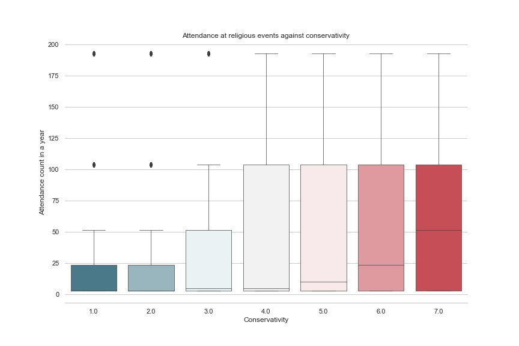
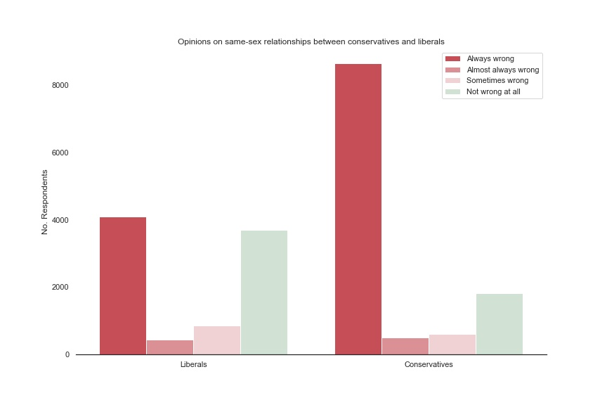
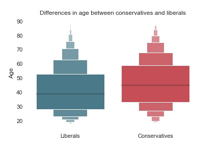

# Finding differences between Conservatives and Liberals

In a US Government class I took in high school, one of the first concepts my professor tried to teach the class was the inherent inaccuracy of the distinction between a "liberal" and a "conservative". The two terms are often used rather loosely, and tend to be associated with slightly different sets of values and ideals for different people. For the purposes of media, liberals and conservatives have have been pit against each other as if the values and behaviors of each group are in complete opposition to each other, and it is likely this process has created broader misconceptions pertaining to each group.

I believe the only accurate understanding of how the two groups differ can be found in the data regarding their values, behaviors, and beliefs. Using the information gathered in the General Social Survey, I developed and executed a method of testing the effect sizes of various features across a section of the GSS dataset to identify the practices and issues around which identifying liberals and conservatives differ most. Here’s how I did it.

## About the General Social Survey

The General Social Survey (GSS) contains responses to a variety of demographic, behavioral, attitudinal, and special interest questions. The survey has been conducted for about 80 years, and is widely considered one of the best sources of sociological and attitudinal data covering the United States. For the purposes of this project, the GSS 'polviews' variable was used, and contains about 50,000 responses to a question regarding how conservative an individual believed they are.

## Trends

After going through the variables in GSS I had available to me, I chose a few variables I thought would greatly differ between liberals and conservatives, and analyzed each of the variables’ distributions, as well as their codewords. The variables I ended up choosing were all categorical in nature, and dealt with the respondents’ trust in others, belief in fairness, and personal happiness. The hypothesis was simple at first- did any of the three variables I selected change consistently with an individual's conservativity? Removing the codewords and plotting each of the variables against the respondents' conservativity showed that my hypothesis was largely incorrect. There was no trend observable in the respondents' belief in fairness or their trust in others. While there was a trend suggesting that conservatives were happier on average than liberals, the effect size wasn't huge, and I still wasn't satisfied with my results.

I then devised an approach to guess which variables I should be looking at in the entire GSS dataset segment I had available. I would start with the incorrect assumption that all variables had substantially more respondents explained by the numerical data than by the codewords, and calculate the effect size of the variable between liberals and conservatives. I would then sort the variables by their effect sizes, and choose the variables with the largest effect sizes for further analysis. 

After making this guess, and removing the variables' associated codewords, the three largest effect sizes I observed were in the following variables, in order of effect size.

1. 'homosex': How tolerant is the respondent of same-sex relationships?
2. 'attend': How frequently does the respondent attend religious events?
3. 'age': What is the respondent's age?

The variables' relationships with conservativity is described in detail below, in order of how insightful I found them.

### Attendance at religious events

This trend is strictly increasing. Explanation of the frequency tiers, which are somewhat logarithmic in nature.

### Opinions on same-sex relationships

Opinions on the matter are fairly polarized. Liberals seem split?

### Age

Liberals tend to be younger than Conservatives. Not by much, though.

## Conclusions

Although some of the trends explored here fit many generalizations we could’ve made already regarding what conservatives and liberals may hold different opinions on, exploring the data behind them exposes both trends that are not immediately obvious and some interesting nuances in the data itself. For one, I was unaware that there would any trend between attendance at religious events and conservativity, but data analysis here yields an effect size of 0.44 across frequency tiers ranging from 0 (for never having attended a religious event to 8 (for attending a religious event daily). After visualizing the trend, I could clearly observe a constant increase in frequency of attendance with increasing levels of conservativity. There're also a couple misconceptions perpetrated by the media we can test here. Analysis of the distribution of conservativity shows that there are actually more people that consider themselves moderate than liberals or conservatives combined, despite the fact the media portrays many Americans as having chosen a side. Although liberals are widely considered to be in support of same-sex relationships, the data reveals that liberals are actually quite split over the issue, with more liberals actually against same-sex relationships than in support of it.
