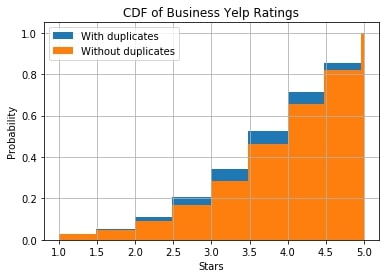
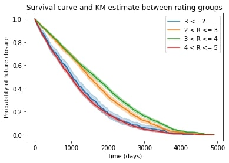

# Estimating the impact of negative Yelp reviews using business closures
Siddharth Garimella

I grew up in a neighborhood in which quite a few businesses came and went in the blink of an eye.
Either they resonated with nearby residents, joining a select few other local mainstays, or they would swiftly be forced to close.

With the advent of online rating platforms such as Yelp, however, I believe 
the margin of error for many small businesses has decreased even further. Yelp 
is becoming an increasingly popular platform for prospective consumers to choose
where to spend their money, and it is more and more important for many new businesses
on Yelp to maintain a good average rating.

But what happens when the ratings go bad? 
Do bad average ratings early on in a company's Yelp page deter customers enough 
to make a measurable financial impact on the business? To answer these questions, 
I run a Survival Analysis using the Yelp Academic dataset for different average ratings
on Yelp, and compare the output to find the difference in probabilities of closure 
at certain times in a business's "lifespan".

### About the Yelp Academic dataset

The Yelp Academic dataset is a subset of Yelp's businesses, reviews, and user data. It was originally put together for the Yelp Dataset Challenge on Kaggle, which was a chance for students to conduct research or analysis on Yelp's data and share their discoveries. The dataset contains information about 174,000 businesses across 11 metropolitan areas in four countries. For these businesses, 5.2 million reviews are provided, complete with the review text, date, and rating in stars.

Most of the businesses on Yelp are customer-facing (that's why they're there). More specifically, analysis of the tags used by each business reveals that there are more restaurants in the dataset than any other type of business. The data was collected between 2004 and 2017.

[Read more about the dataset here.](https://www.kaggle.com/yelp-dataset/yelp-dataset#yelp_academic_dataset_business.json)

### Guessing a business's lifespan

The dataset itself does not explicitly provide information about how long businesses last. Instead, all that is known for each business is whether the business is open or closed at the time of the dataset’s publication, and the dates of every review provided for that business on Yelp. 

One way we can “guess” how long a business on Yelp could have lasted is by finding the difference between the newest and oldest Yelp reviews for that business. This technique is used to analyze the potential impact of negative Yelp ratings later in the report, and it is important to note while reading that analysis that I’ve assumed this difference could provide a good estimate for actual closed businesses’ lifespans.

### Survival curves across Yelp rating tiers

There are nine unique ratings users can issue in a review on Yelp. They are 1 through 5 (inclusive), with intervals of half a star. An analysis of the distribution of ratings on Yelp shows that there are not all that many low star reviews on Yelp, with the most common rating being 4.

Removing duplicate businesses is important as it reduces the effect chain restaurants will have on the data. Such businesses are highly unlikely to close, and would have a disproportionate impact on the analysis due to the class size effect.

While it would normally first be best to understand how ratings are distributed in the dataset using a CDF, the data is right-censored, meaning we don't really know how long the lifespans of businesses that are currently still open will last. It is better to use survival curves to compare the data.

This plot is quite strange, as the 

A rating of four stars seems to be the most common rating given to businesses on Yelp. A CDF shows this distribution well.

 However, as the difference between 4.5 and 5 may not matter much for the closure of a business, I create rating tiers using which differences in closures due to ratings could be better understood. The rating tiers are based off the distributions of each rating. 

The above CDF illustrates the stratification in the various tiers' distributions. 

